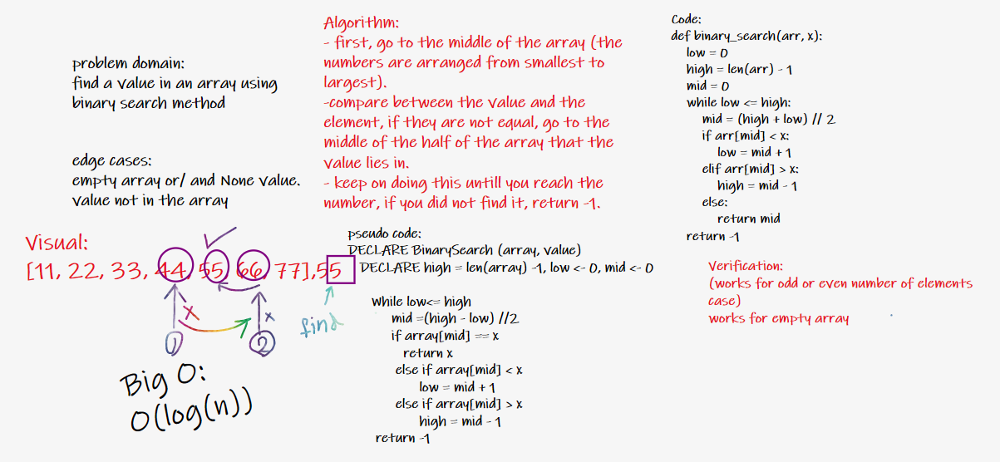

# Binary Search of Sorted Array
Write a function called BinarySearch which takes in 2 parameters: a sorted array and the search key. Without utilizing any of the built-in methods available to your language, return the index of the array’s element that is equal to the value of the search key, or -1 if the element is not in the array.
NOTE: The search algorithm used in your function should be a binary search.
Check the Resources section for details
Example

## Whiteboard Process

## Approach & Efficiency

Big O:
O(log(n))
first, go to the middle of the array (the numbers are arranged from smallest to largest).
-compare between the value and the element, if they are not equal, go to the middle of the half of the array that the value lies in.
- keep on doing this untill you reach the number, if you did not find it, return -1. 
