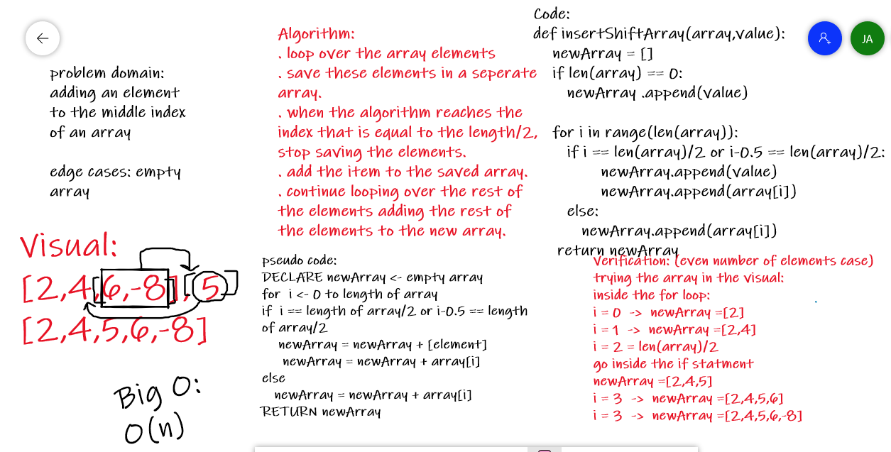

# Insert to Middle of an Array
Write a function called insertShiftArray which takes in an array and a value to be added. Without utilizing any of the built-in methods available to your language, return an array with the new value added at the middle index.

## Whiteboard Process

## Approach & Efficiency
<!-- What approach did you take? Discuss Why. What is the Big O space/time for this approach? -->
I usually like the approach of declaring a new variable and instead of modifying the original one, building up a new variable from scrtch is easier.
that is what I did for this problem as well. declared a variable, started adding elements untill reaching the middle of the array, then added the element from the question, then continue adding the rest of the elements of the original array to the new one.
the big O for this function is O(n), which is reasonable.
