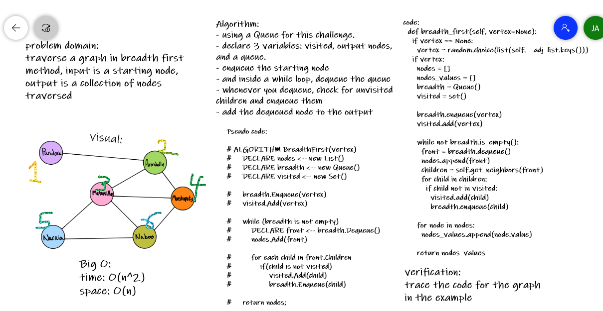

# Graphs
Graphs are data structures that have nodes connected to each other with edges.

## Challenge
implement a graph data structure, with methods: add node, get nodes, add edge, get neighbors, and size.

## Efficiency
add node: O(1)
get nodes: O(n)
add edge: O(1)
get neighbors: O(n)
size: O(n)

## API
- add node
Arguments: value

Returns: The added node

Add a node to the graph

- add edge
Arguments: 2 nodes to be connected by the edge

Returns: nothing

Adds a new edge between two nodes in the graph

Both nodes should already be in the Graph

- get nodes
Arguments: none

Returns all of the nodes in the graph as a collection (set, list, or similar)

- get neighbors
Arguments: node

Returns a collection of edges connected to the given node

Include the weight of the connection in the returned collection

- size
Arguments: none

Returns the total number of nodes in the graph

# Graphs breadth first
traverse graphs in the breadth first method

## Efficiency
O(n^2)

## whiteboard

# Graph Business Trip
Write a function called business trip that takes the Arguments: (graph, array of city names)and returns: cost or null.
Determine whether the trip is possible with direct flights, and how much it would cost.

## Efficiency
O(n^2)

## Approach
 I had to write down a helper method: get edges, it made my solution more easier.

## whiteboard

