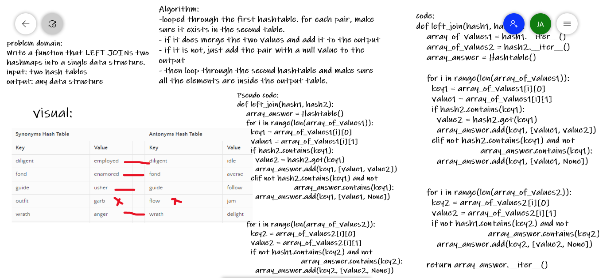

# Hashtables
Hash tables are data structures that make it fast to retrive data. it uses a hash function to determine where the data should be placed.

## Challenge
Implement a hash table with 4 methods: add, get, hash, and contains

## Approach & Efficiency
I used the already there hash function from pytho, and made a hash table class of 100 slot-array.
The big O of adding a value is O(1)
the Big O of retriving data varies depending on the data there, but it should be less than O(n)

## API
- add
Arguments: key, value
Returns: nothing
This method should hash the key, and add the key and value pair to the table, handling collisions as needed.
- get
Arguments: key
Returns: Value associated with that key in the table
- contains
Arguments: key
Returns: Boolean, indicating if the key exists in the table already.
- hash
Arguments: key
Returns: Index in the collection for that key

# Hashmap LEFT JOIN
<!-- Short summary or background information -->
Hashmap left join is a function that joins two hashtables together in a certain form.

## Challenge
<!-- Description of the challenge -->
Write a function that LEFT JOINs two hashmaps into a single data structure.

Write a function called left join
Arguments: two hash maps
The first parameter is a hashmap that has word strings as keys, and a synonym of the key as values.
The second parameter is a hashmap that has word strings as keys, and antonyms of the key as values.
Return: The returned data structure that holds the results is up to you. It doesn’t need to exactly match the output below, so long as it achieves the LEFT JOIN logic

## Approach & Efficiency
<!-- What approach did you take? Why? What is the Big O space/time for this approach? -->
-looped through the first hashtable. for each pair, make sure it exists in the second table.
- if it does merge the two values
- if it is not, just add the pair with a null value
- then loop through the second hashtable and make sure all the elements are inside the output table.

time O(n^2)
space O(n)

## Solution
