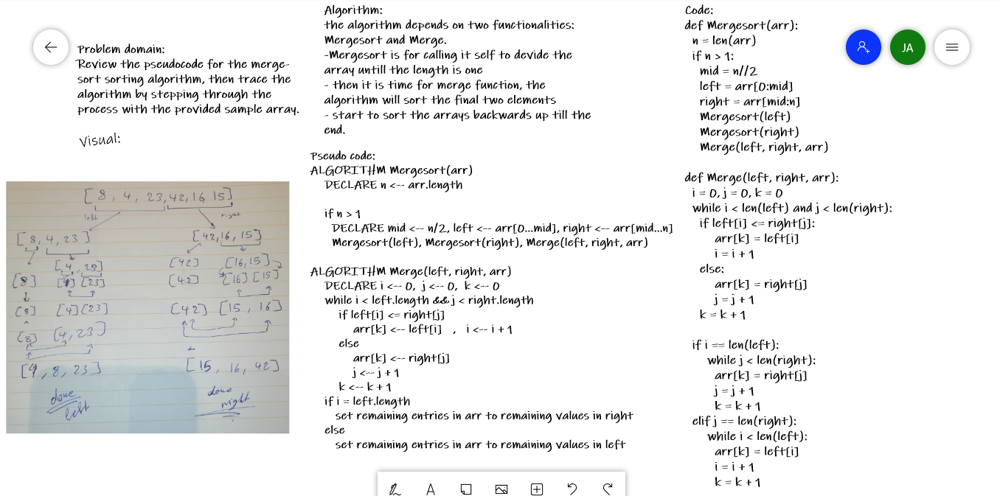

# Challenge Summary
Review the pseudocode, then trace the algorithm by stepping through the process with the provided sample array.

## Whiteboard Process

## Approach & Efficiency
it has a time complexity of O(n*log n), a space complexity of  O(n)

