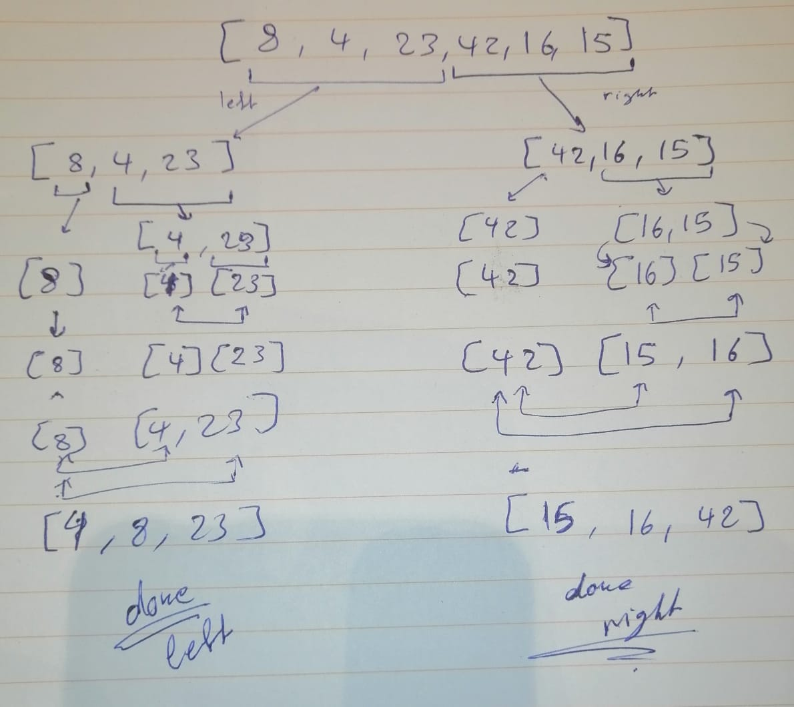
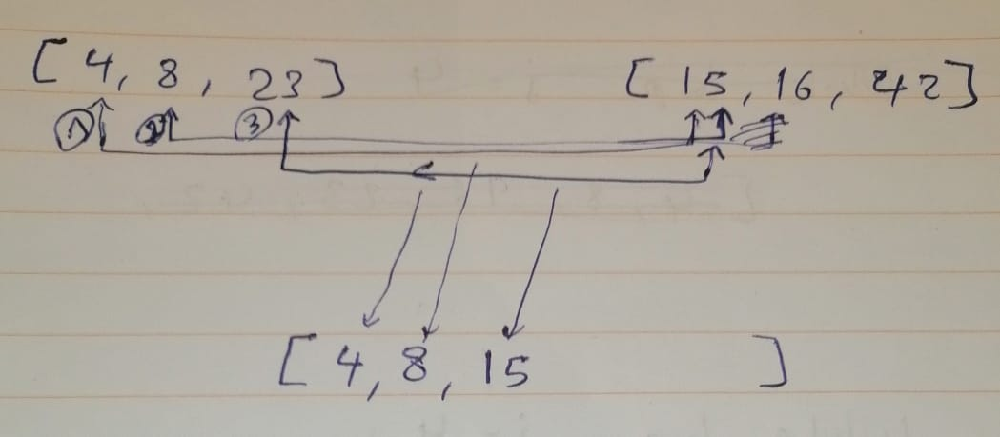
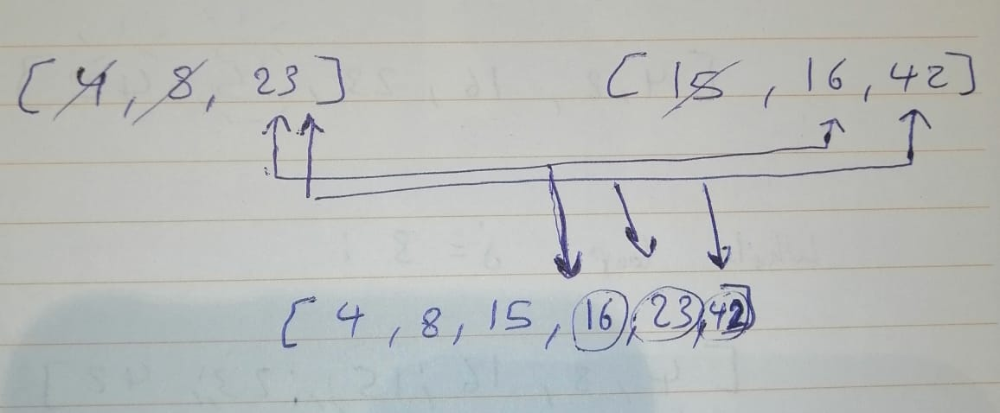

# Merge Sort Algorithm

In this article, we will be looking at another sorting algorithm for arrays: Merge-Sort.
it has a time complexity of O(n*log n), a space complexity of  O(n), and it is also a stable sort.

the algorithm depends on two functionalities: Mergesort and Merge.

- Mergesort is for calling it self to devide the array untill the length is one, then it is time for merge function, the algorithm will sort the final two elements, and then start to sort the arrays backwards up till the end.
check this psuedo code:


```
ALGORITHM Mergesort(arr)
    DECLARE n <-- arr.length

    if n > 1
      DECLARE mid <-- n/2
      DECLARE left <-- arr[0...mid]
      DECLARE right <-- arr[mid...n]
      // sort the left side
      Mergesort(left)
      // sort the right side
      Mergesort(right)
      // merge the sorted left and right sides together
      Merge(left, right, arr)

ALGORITHM Merge(left, right, arr)
    DECLARE i <-- 0
    DECLARE j <-- 0
    DECLARE k <-- 0

    while i < left.length && j < right.length
        if left[i] <= right[j]
            arr[k] <-- left[i]
            i <-- i + 1
        else
            arr[k] <-- right[j]
            j <-- j + 1

        k <-- k + 1

    if i = left.length
       set remaining entries in arr to remaining values in right
    else
       set remaining entries in arr to remaining values in left

```

### Let's walk through this code using the example array: [8,4,23,42,16,15]
### checkout the image below for a visualization for the process:

*Note that single arrows -> mean that the array is under the effect of MERGESORT function, while the double arrow: <--> mean that the array is under the effect of MERGE function. and that the latter is the one that compares between values.*



the result at the end is two sorted arrays, left and right.
now the final call of MERGE function:





And that's it!
