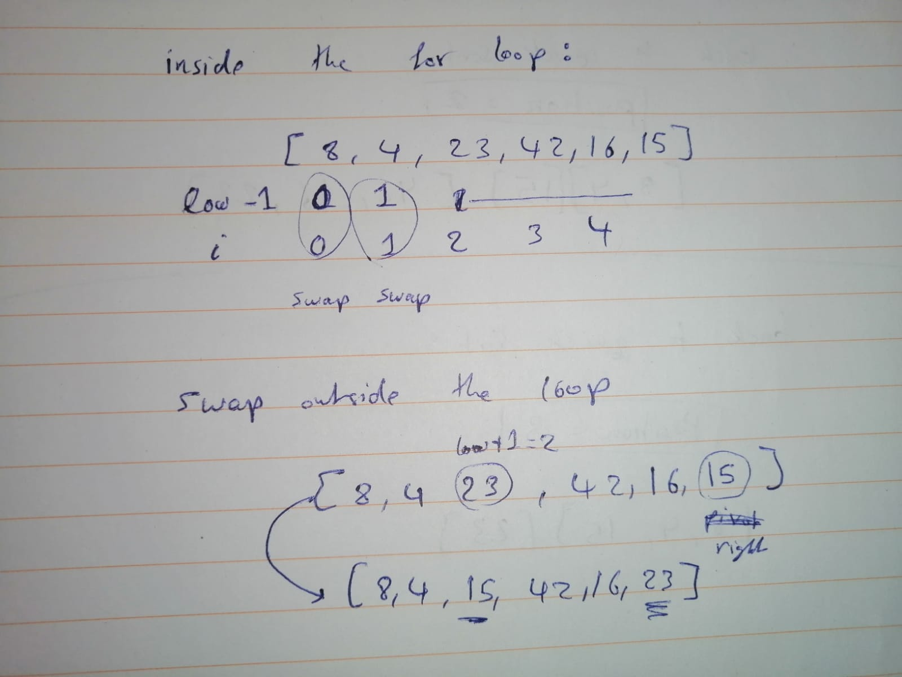
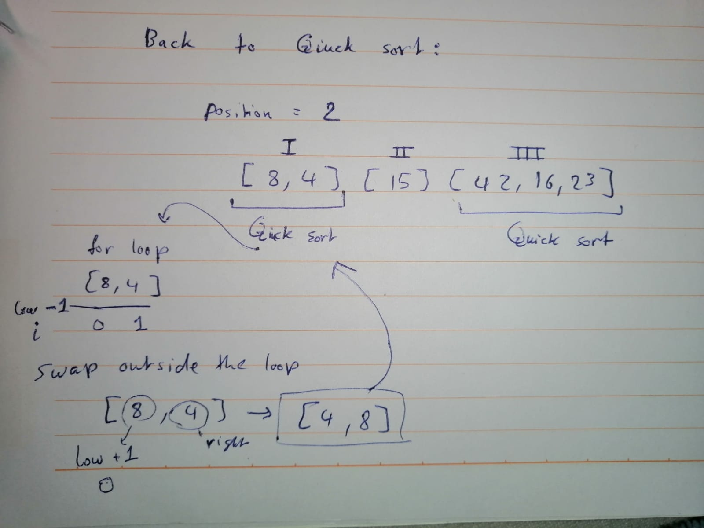
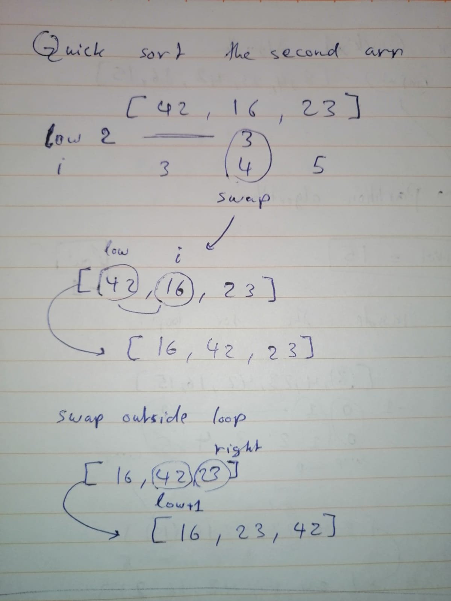
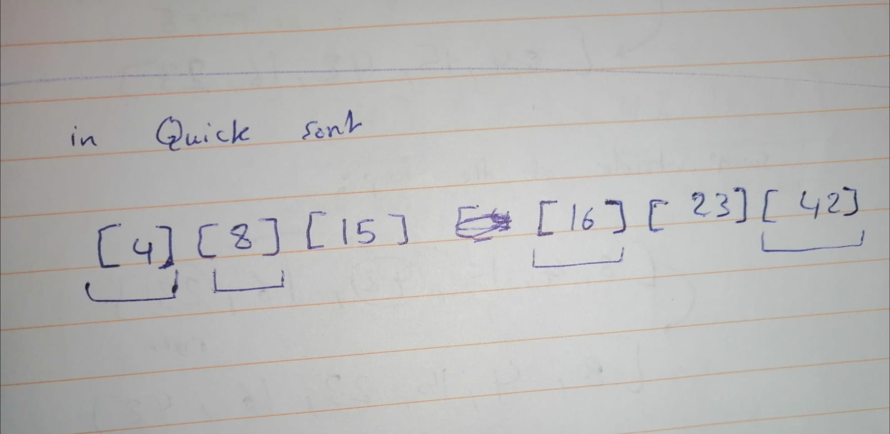

# Quick Sort

In this blog we will be looking at a way to another way of sorting an array. first, checkout the pseudo code below:

```
Pseudo Code
ALGORITHM QuickSort(arr, left, right)
    if left < right
        // Partition the array by setting the position of the pivot value
        DEFINE position <-- Partition(arr, left, right)
        // Sort the left
        QuickSort(arr, left, position - 1)
        // Sort the right
        QuickSort(arr, position + 1, right)

ALGORITHM Partition(arr, left, right)
    // set a pivot value as a point of reference
    DEFINE pivot <-- arr[right]
    // create a variable to track the largest index of numbers lower than the defined pivot
    DEFINE low <-- left - 1
    for i <- left to right do
        if arr[i] <= pivot
            low++
            Swap(arr, i, low)

     // place the value of the pivot location in the middle.
     // all numbers smaller than the pivot are on the left, larger on the right.
     Swap(arr, right, low + 1)
    // return the pivot index point
     return low + 1

ALGORITHM Swap(arr, i, low)
    DEFINE temp;
    temp <-- arr[i]
    arr[i] <-- arr[low]
    arr[low] <-- temp
```

as you can see, there are *three* seperate Algorithms(functions),and each one is responsible of a seperate part of the whole process.

- Partition: this one does the core work of sorting, as well as finding where the array should be devided to do the next round of sorting.
- Quick sort: this algorithm instructs the new arrays to be sorted in the same way after partitioning.
- swap : this one as the little helper algorithm. it swaps elements when needed.

Let's go to the example, our beatiful way to undertand everything.
Taking the array: [8,4,23,42,16,15]

Plugging it in QuickSort Algorithm, then the array partition algorithm is called.
inside the partition algorithm, the pivot point is equal to 15. check the picture below, that traces the variables:




Now back to Quick sort:



as we can see, the array is sort of divided now, and each part goes back to Quick sort in a recursion.

for the third part of the array now:



finally, the array will be divided so that each element is on it's own, this is where we know that the array is completly sorted.



