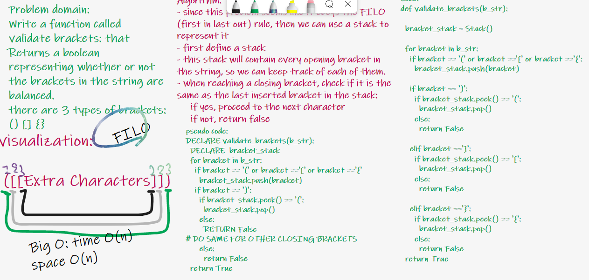

# Challenge Summary

Write a function called validate brackets:

- Arguments: string
- Return: boolean
- representing whether or not the brackets in the string are balanced
- There are 3 types of brackets:

  - Round Brackets : ()
  - Square Brackets : []
  - Curly Brackets : {}

## Whiteboard Process

## Approach & Efficiency

- since this problem seems like it obeys the FILO (first in last out) rule, then we can use a stack to represent it
- first define a stack
- this stack will contain every opening bracket in the string, so we can keep track of each of them.
- when reaching a closing bracket, check if it is the same as the last inserted bracket in the stack:
     if yes, proceed to the next character
     if not, return false

Big O: time O(n)
space O(n)
