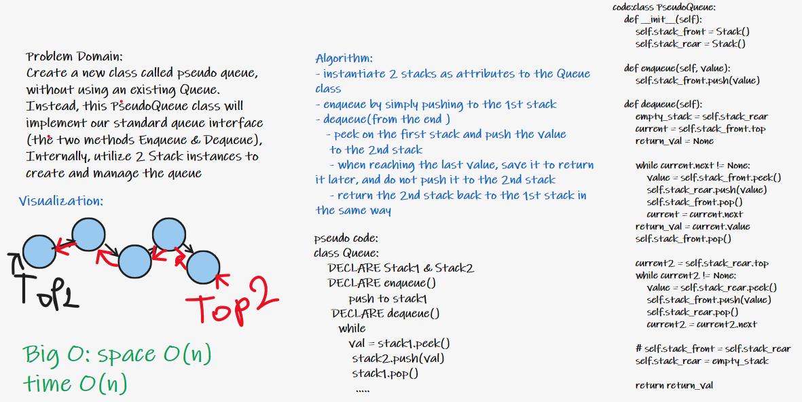

# Challenge Summary

Create a new class called pseudo queue, without using an existing Queue.
Instead, this PseudoQueue class will implement our standard queue interface (the two methods Enqueue & Dequeue),
Internally, utilize 2 Stack instances to create and manage the queue

## Whiteboard Process

## Approach & Efficiency
- instantiate 2 stacks as attributes to the Queue class
- enqueue by simply pushing to the 1st stack
- dequeue(from the end )
   - peek on the first stack and push the value
    to the 2nd stack
    - when reaching the last value, save it to return it later, and do not push it to the 2nd stack
    - return the 2nd stack back to the 1st stack in the same way

__Big O:__
space O(n)
time O(n)

