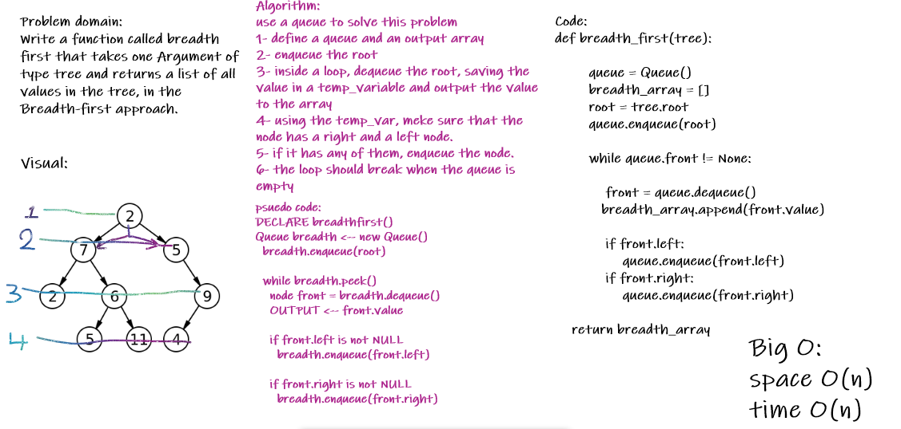
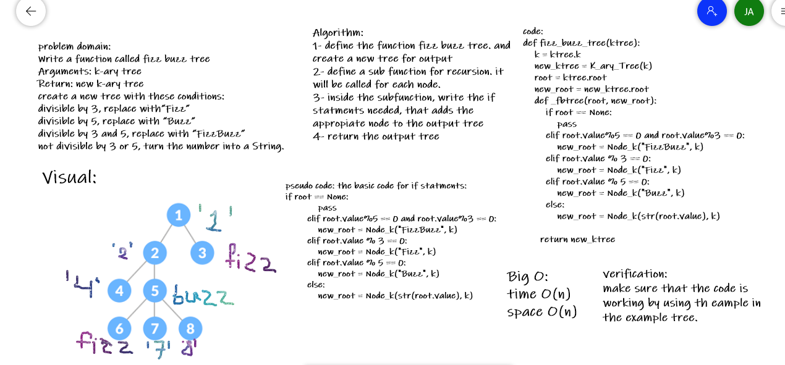

# Trees
rees is a data structure that simulates a hierarchical tree structure, with a root value and subtrees of children.

## Challenge
writing 3 different methods to Traverse through the tree.
building a binary search trees

## Approach & Efficiency

I took the approach of recursion for the Traversin g methods. which has big O of (n) of time and O(1) of space.

as of the binary search trees. the Big O of time is O(log(n)) and space O(1)

Code Challenge 16
# Challenge Summary
Find the Maximum Value in a Binary Tree

## Whiteboard Process

## Approach & Efficiency

will use recursion and nested functions for this, to keep things neat.
Big O:
space: O(n)
time: O(n)

Code Challenge 17
# Challenge Summary
Write a function called breadth first that takes one Argument of type tree and returns a list of all values in the tree, in the Breadth-first approach.

## Whiteboard Process

## Approach & Efficiency
using a queue to solve this problem.
Big O:
space O(n)
time O(n)

Code Challenge 18
# Challenge Summary
Write a function called fizz buzz tree

Arguments: k-ary tree

Return: new k-ary tree

If the value is divisible by 3, replace the value with “Fizz”

If the value is divisible by 5, replace the value with “Buzz”

If the value is divisible by 3 and 5, replace the value with “FizzBuzz”

If the value is not divisible by 3 or 5, simply turn the number into a String.

## Whiteboard Process

## Approach & Efficiency
Using recursion for this challenge.
Big O:
space O(n)
time O(n)

